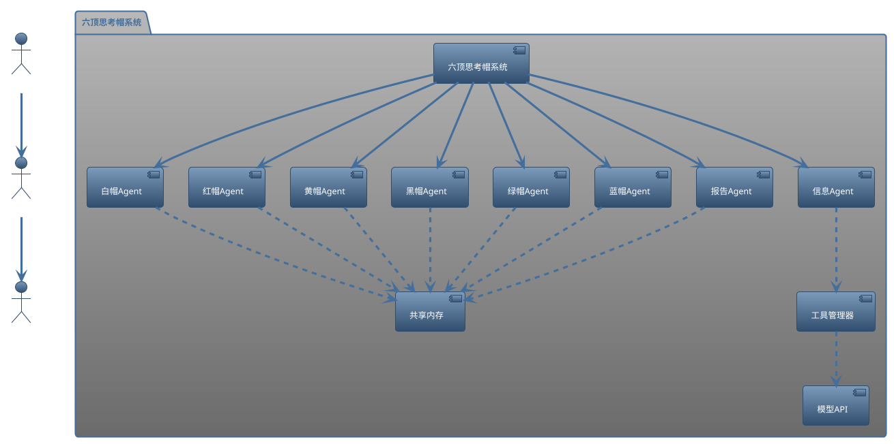
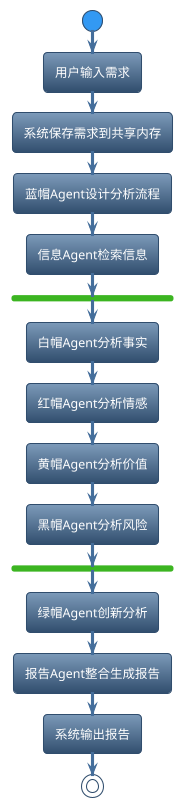
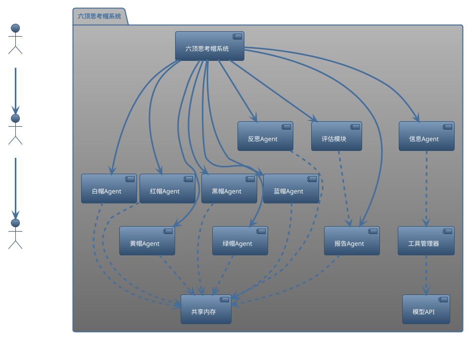
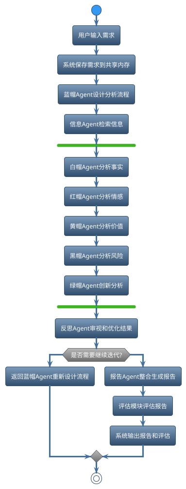

# 运行
```
pip install -r requierments.txt
python six_hat_bot.py -v
```

# 六顶思考帽多Agent分析系统架构说明
## 系统架构概述
本系统基于六顶思考帽理论，采用多Agent协作方式，对需求进行多角度、全方位分析。系统核心由六种思考帽Agent、信息搜集Agent、报告生成Agent、工具管理器、共享内存和模型API接口组成。

---

## 系统架构图（PlantUML）


---

## 典型分析流程说明
1. 用户输入需求。
2. 系统保存需求到共享内存。
3. 蓝帽Agent设计分析流程。
4. 信息Agent自动检索相关信息。
5. 白/红/黄/黑帽Agent并行分析不同维度。
6. 绿帽Agent进行创新思维分析。
7. 报告Agent整合所有分析结果，生成最终报告。
8. 系统输出报告给用户。

---

## 分析流程图（PlantUML）


---
如需详细类方法说明，请参考 six_hat_bot.py 源码注释。

架构图
架构图展示了更新后系统的组件及其之间的关系。系统通过模块化设计协调多个Agent完成用户需求的分析，并生成报告。



说明
用户：通过接口输入需求并接收最终报告和评估结果。

六顶思考帽系统：核心系统，包含以下组件：
共享内存：用于Agent之间共享信息。

工具管理器：调用外部工具（如搜索和网页内容获取）。

模型API：与大语言模型（如Azure OpenAI和OpenRouter）交互。

Agent：
蓝帽Agent：设计分析流程。

白帽Agent：分析客观事实。

红帽Agent：分析情感和直觉。

黄帽Agent：分析积极性和可行性。

黑帽Agent：分析风险和问题。

绿帽Agent：提供创新思维和新方案。

信息Agent：检索外部信息。

报告Agent：整合分析结果生成报告。

反思Agent：优化其他Agent的输出。

评估模块：评估生成的报告质量。

关系：系统控制器协调各Agent，Agent通过共享内存交互，信息Agent依赖工具管理器和模型API获取数据。

工作流程图
工作流程图描述了系统分析用户需求的步骤，包括并行分析、反思迭代和报告生成。



说明
用户输入需求：流程起点。

保存需求：系统将需求存储到共享内存。

流程设计：蓝帽Agent制定分析计划。

信息检索：信息Agent收集相关外部数据。

并行分析：六顶思考帽Agent同时从不同角度分析：
白帽：事实和数据。

红帽：情感和直觉。

黄帽：价值和优点。

黑帽：风险和缺点。

绿帽：创新和新思路。

反思优化：反思Agent检查分析结果并优化。

迭代决策：根据反思结果决定是否重新分析。

报告生成：报告Agent整合所有分析生成最终报告。

报告评估：评估模块对报告质量打分。

输出结果：系统向用户返回报告和评估。

