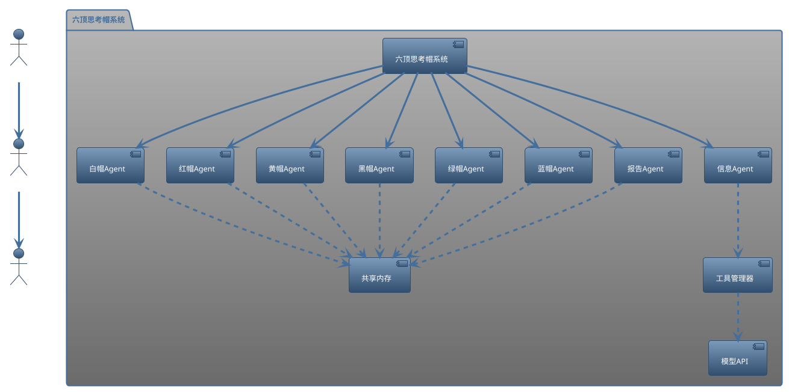
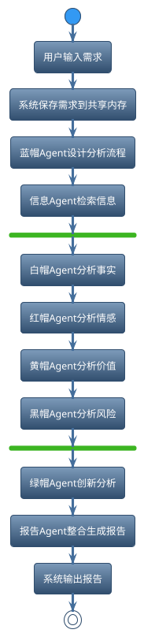
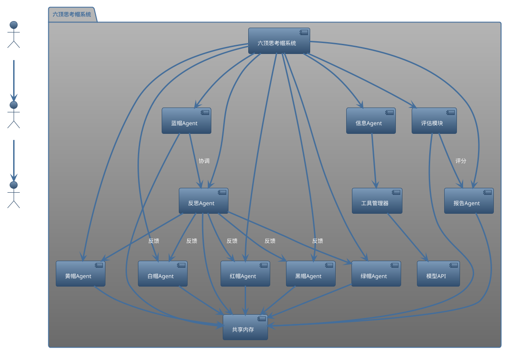
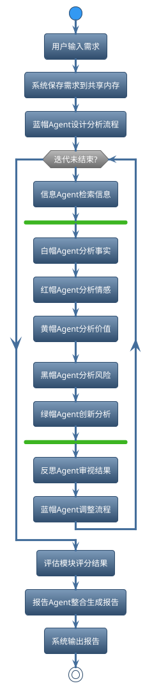

# 运行
```
pip install -r requierments.txt
python six_hat_bot.py -v
```

# 六顶思考帽多Agent分析系统架构说明
## 系统架构概述
本系统基于六顶思考帽理论，采用多Agent协作方式，对需求进行多角度、全方位分析。系统核心由六种思考帽Agent、信息搜集Agent、报告生成Agent、工具管理器、共享内存和模型API接口组成。

---

## 系统架构图（PlantUML）


---

## 典型分析流程说明
1. 用户输入需求。
2. 系统保存需求到共享内存。
3. 蓝帽Agent设计分析流程。
4. 信息Agent自动检索相关信息。
5. 白/红/黄/黑帽Agent并行分析不同维度。
6. 绿帽Agent进行创新思维分析。
7. 报告Agent整合所有分析结果，生成最终报告。
8. 系统输出报告给用户。

---

## 分析流程图（PlantUML）


---
如需详细类方法说明，请参考 six_hat_bot.py 源码注释。

## 优化后的架构图
以下是优化后的系统架构图，增加了反思Agent、评估模块，并明确了Agent间的交互：



## 优化后的分析流程
