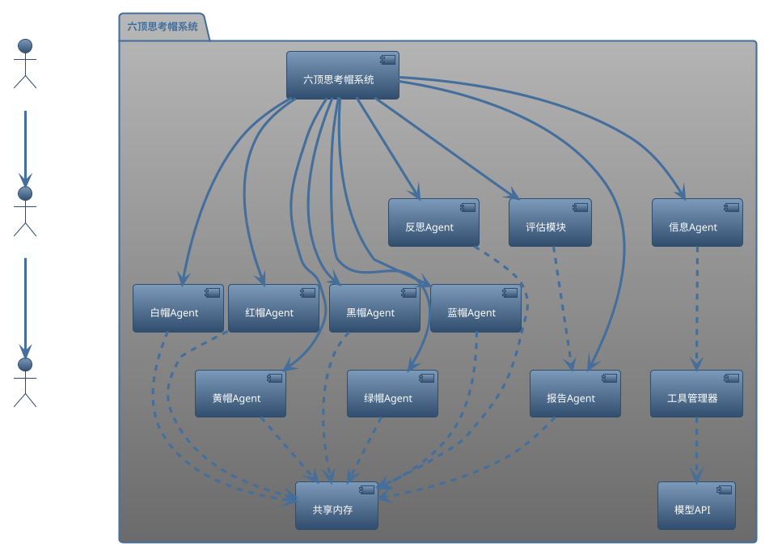
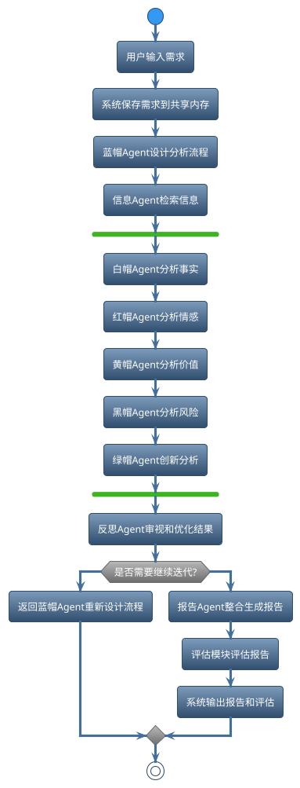

# 六顶思考帽多Agent分析系统

基于六顶思考帽理论打造的多Agent协作分析系统，能够对需求进行多角度、全方位分析，生成全面深入的分析报告。

## 目录
- [快速开始](#快速开始)
- [系统架构](#系统架构概述)
- [分析流程](#典型分析流程说明)
- [环境变量配置](#环境变量配置)
- [命令行参数](#命令行参数)
- [输入输出示例](#输入输出示例)
- [常见问题](#常见问题)
- [扩展系统](#扩展系统)
- [架构详细说明](#架构详细说明)

## 快速开始

### 1. 克隆仓库
```bash
git clone https://github.com/your-username/six-hat-bot.git
cd six-hat-bot
```

### 2. 配置环境变量
在项目根目录创建`.env`文件，填入以下内容：

```
# 选择API类型: azure 或 openrouter
API_TYPE=azure

# 如果使用Azure OpenAI
AZURE_OPENAI_API_KEY=your_azure_api_key
AZURE_OPENAI_ENDPOINT=https://your-resource_name.openai.azure.com/
AZURE_OPENAI_DEPLOYMENT=your_deployment_name

# 如果使用OpenRouter
OPENROUTER_API_KEY=your_openrouter_api_key
OPENROUTER_MODEL=anthropic/claude-3-opus:beta
```

### 3. 安装依赖
```bash
pip install -r requirements.txt
```

### 4. 运行系统
```bash
python six_hat_bot.py
```

开启详细日志模式：
```bash
python six_hat_bot.py -v
```

## 系统架构概述
本系统基于六顶思考帽理论，采用多Agent协作方式，对需求进行多角度、全方位分析。系统核心由六种思考帽Agent、信息搜集Agent、报告生成Agent、工具管理器、共享内存和模型API接口组成。

### 系统架构图


## 典型分析流程说明
1. 用户输入需求。
2. 系统保存需求到共享内存。
3. 蓝帽Agent设计分析流程。
4. 信息Agent自动检索相关信息。
5. 白/红/黄/黑帽Agent并行分析不同维度。
6. 绿帽Agent进行创新思维分析。
7. 反思Agent审视和优化分析结果。
8. 报告Agent整合所有分析结果，生成最终报告。
9. 评估模块对报告质量进行评分。
10. 系统输出报告给用户。

### 分析流程图


## 环境变量配置

系统支持两种大模型API：Azure OpenAI和OpenRouter。需要在`.env`文件中设置以下环境变量：

| 环境变量 | 说明 | 示例值 |
|----------|------|--------|
| API_TYPE | 选择API类型 | azure 或 openrouter |
| AZURE_OPENAI_API_KEY | Azure OpenAI的API密钥 | sk-xxxxxxxxxxxxxxxxxxxx |
| AZURE_OPENAI_ENDPOINT | Azure OpenAI的API端点 | https://your-resource.openai.azure.com/ |
| AZURE_OPENAI_DEPLOYMENT | Azure OpenAI的部署名称 | gpt-4 |
| OPENROUTER_API_KEY | OpenRouter的API密钥 | sk-or-xxxxxxxxxxxxxxxxxxxx |
| OPENROUTER_MODEL | OpenRouter使用的模型名称 | anthropic/claude-3-opus:beta |

### 如何获取API密钥

#### Azure OpenAI API密钥
1. 访问[Azure Portal](https://portal.azure.com/)
2. 创建或选择OpenAI资源
3. 在"密钥和终结点"部分获取API密钥和终结点
4. 在"部署"部分创建部署并记录部署名称

#### OpenRouter API密钥
1. 访问[OpenRouter官网](https://openrouter.ai/)
2. 注册账号并登录
3. 在Dashboard中创建API密钥

## 命令行参数

系统支持以下命令行参数：

| 参数 | 说明 |
|------|------|
| -v, --verbose | 启用详细日志模式，输出详细的运行信息 |
| -h, --help | 显示帮助信息 |

示例：
```bash
# 普通模式运行
python six_hat_bot.py

# 详细日志模式运行
python six_hat_bot.py -v
```

## 输入输出示例

### 输入示例
当运行程序后，系统会提示输入需求描述：
